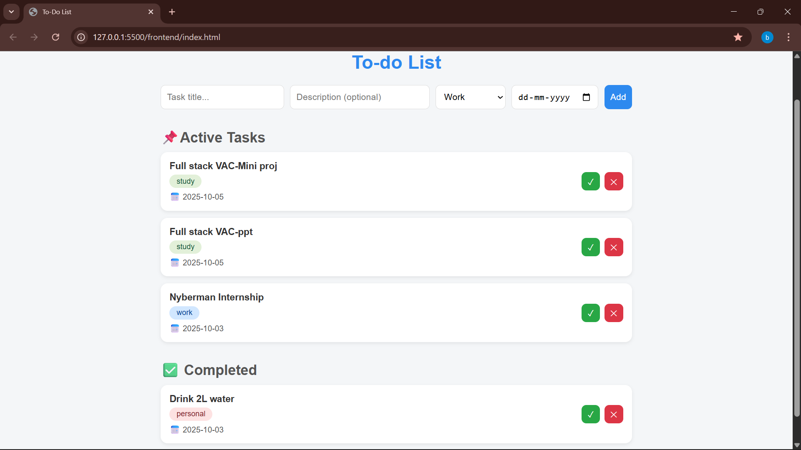

# To-Do App

## 📝 Overview
This is a full-stack **To-Do List application**. It has a Node.js backend to handle data operations and a simple HTML/CSS/JavaScript frontend for the user interface. All tasks are stored and managed in a **MySQL database**.

Users can **add tasks**, **mark them as complete**, **delete tasks**, and view tasks sorted by active/completed status.


## 🚀 Features
- Add Tasks with **title, description, category tag, and due date**.  
- Toggle Status: Mark tasks as complete or incomplete.  
- Delete Tasks: Remove tasks permanently from the list.  
- Persistent Data: All tasks are saved in a MySQL database.  


## 🛠️ Technology Stack
- **Frontend:** HTML, CSS, JavaScript (Fetch API)  
- **Backend:** Node.js, Express.js  
- **Database:** MySQL  


## ⚙️ Setup and Installation

### Prerequisites
- [Node.js](https://nodejs.org/)  
- [MySQL](https://dev.mysql.com/downloads/installer/)  


### Step 1: Clone the Repository

git clone https://github.com/bbhavs/todo-app.git
cd todo-app


### Step 2: Database Setup

1. Open **MySQL Workbench** or your preferred client.
2. Connect to your local MySQL server.
3. Run the following SQL commands:

```sql
CREATE DATABASE todo_db;
USE todo_db;
CREATE TABLE tasks (
    id INT AUTO_INCREMENT PRIMARY KEY,
    title VARCHAR(255) NOT NULL,
    description TEXT,
    tag VARCHAR(50),
    date DATE,
    status BOOLEAN DEFAULT 0
);
```

---

### Step 3: Backend Configuration

1. Navigate to the backend folder:

```bash
cd backend
```

2. Install required Node.js packages:

```bash
npm install express mysql2 cors
```

3. Open `server.js` and update your MySQL connection details:

```javascript
const db = mysql.createConnection({
  host: "localhost",
  user: "root",
  password: "YOUR_MYSQL_PASSWORD_HERE", << change
  database: "todo_db"
});
```

---

### Step 4: Run the Application

1. Start the backend server:

```bash
node server.js
```

2. Open `index.html` in your browser (or serve via Express if preferred).

The app should now be running and connected to your MySQL database.

---

## 🖼️ Screenshots (output)

---


